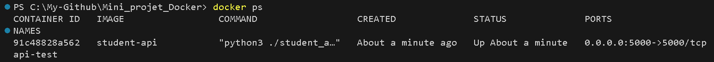
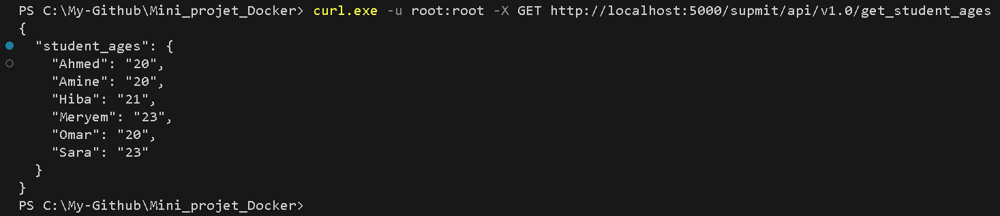
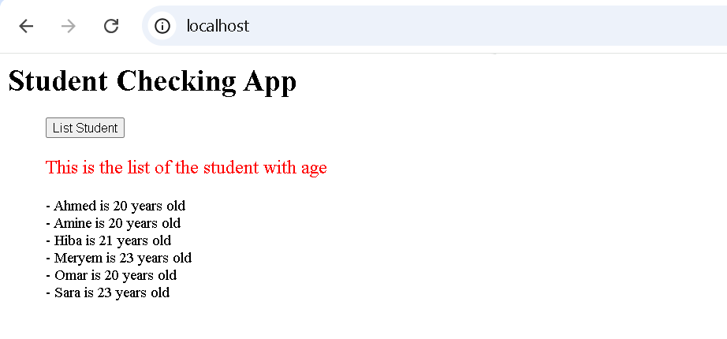

# Mini-Projet: Conteneurisation d'une Application avec Docker

Ce projet consiste en la conteneurisation d'une application pour l'entreprise SUPMIT, une société informatique marocaine qui développe des logiciels pour les universités. L'objectif est de créer une infrastructure Docker pour une application composée d'une API REST en Python (Flask) et d'une interface web en PHP.

## Table des matières
1. [Description du projet](#description-du-projet)
2. [Structure du projet](#structure-du-projet)
3. [Construction et test de l'API](#construction-et-test-de-lapi)
4. [Infrastructure as Code](#infrastructure-as-code)
5. [Docker Registry](#docker-registry)

## Description du projet

SUPMIT souhaite améliorer son infrastructure existante pour la rendre évolutive, facilement déployable et hautement automatisée. L'application "student_list" permet d'afficher la liste des étudiants avec leur âge et se compose de deux modules:
- Une API REST en Python avec Flask qui fournit les données des étudiants à partir d'un fichier JSON
- Une application web en PHP qui permet aux utilisateurs d'obtenir la liste des étudiants

## Structure du projet

Le projet est organisé comme suit:
```
.
├── docker-compose.yml
├── docker-compose-registry.yml
├── simple_api
│   ├── Dockerfile
│   ├── requirements.txt
│   ├── student_age.json
│   └── student_age.py
└── website
    └── index.php
```

## Construction et test de l'API

### Dockerfile pour l'API

Le Dockerfile de l'API a été créé selon les spécifications suivantes:

- Utilisation de l'image de base `python:3.8-buster`
- Ajout des informations du mainteneur via l'instruction `LABEL`
- Copie du code source et des fichiers de configuration nécessaires (`student_age.py` et `requirements.txt`)
- Installation des prérequis système et des dépendances Python
- Configuration d'un volume pour les données persistantes (`/data`)
- Exposition explicite du port `5000` pour l'API
- Définition de la commande de démarrage avec `CMD`

```dockerfile
FROM python:3.8-buster

LABEL maintainer="Anas Ichmawin anasichmawin87@gmail.com, Mohamed-Amine Fatih fatihmohamedamine5@gmail.com, Mourad Imani imanimourad92@gmail.com"


WORKDIR /

# Installation des dépendances système
RUN apt update -y && apt install python3-dev libsasl2-dev libldap2-dev libssl-dev -y

# Copie des fichiers nécessaires
COPY student_age.py requirements.txt /

# Installation des packages Python
RUN pip3 install -r /requirements.txt

# Création du répertoire de données
RUN mkdir -p /data
VOLUME ["/data"]

# Exposition du port
EXPOSE 5000

# Commande de démarrage
CMD ["python3", "./student_age.py"]
```

### Test de l'API

Pour tester l'API individuellement, exécutez les commandes suivantes:

```bash
# Construction de l'image
docker build -t student-api ./simple_api

# Lancement du conteneur
docker run -d -p 5000:5000 -v ${PWD}/simple_api/student_age.json:/data/student_age.json -e student_age_file_path=/data/student_age.json --name api-test student-api
```

Ensuite, vérifiez que l'API répond correctement:

```bash
curl.exe -u root:root -X GET http://localhost:5000/supmit/api/v1.0/get_student_ages

```
****  
****  

## Infrastructure as Code

### Docker Compose

Le fichier docker-compose.yml a été créé pour déployer l'ensemble de l'application:

```yaml
services:
  api:
    build: ./simple_api
    ports:
      - "5000:5000"  
    volumes:
      - data:/data  
      - ./simple_api/student_age.json:/data/student_age.json
    networks:
      - app_network 

  website:
    image: php:apache 
    volumes:
      - ./website:/var/www/html 
    depends_on:
      - api
    ports:
      - "80:80"  
    environment:
      - USERNAME=root 
      - PASSWORD=root
    networks:
      - app_network

networks:
  app_network:

volumes:
  data: 
```
Ce fichier définit:

- Le service **API** utilisant l'image construite à partir du Dockerfile.
- Le service **website** utilisant l'image **php**.
- Un réseau spécifique pour permettre la communication entre les services.
- Un volume pour persister les données de l'API.


### Déploiement et test avec Docker Compose

Pour déployer l'application complète:

```bash
docker-compose up -d
```

Ensuite, accédez à l'interface web via un navigateur à l'adresse http://localhost et cliquez sur le bouton "List Student".
****  

## Docker Registry

### Configuration du Registry privé

Le fichier `docker-compose-registry.yml` était vide et a été créé pour déployer un registry Docker privé avec une interface web:

```yaml
services:
  registry:
    image: registry:2
    container_name: my_registry
    ports:
      - "5000:5000"
    volumes:
      - ./data:/var/lib/registry
    networks:
      - app_network

  registry-ui:
    image: joxit/docker-registry-ui:latest
    container_name: registry_ui
    ports:
      - "8080:80"
    environment:
      - REGISTRY_URL=http://registry:5000 
    depends_on:
      - registry
    networks:
      - app_network

networks:
  app_network:
    driver: bridge
```

### Déploiement du Registry

Pour déployer le registry:

```bash
docker-compose -f docker-compose-registry.yml up -d
```

**[Insérez ici une capture d'écran montrant l'interface du registry]**

### Publication de l'image sur le Registry

Pour publier l'image de l'API sur le registry local:

```bash
# Tagger l'image
docker tag student-api localhost:5000/student-api:latest

# Pousser l'image vers le registry
docker push localhost:5000/student-api:latest
```

**[Insérez ici une capture d'écran montrant le push de l'image vers le registry]**

**[Insérez ici une capture d'écran de l'interface UI montrant l'image publiée]**

## Conclusion

Ce projet démontre comment Docker peut améliorer le déploiement d'applications en:
1. Facilitant la gestion des dépendances
2. Assurant la cohérence entre les environnements
3. Simplifiant le déploiement grâce à l'Infrastructure as Code
4. Fournissant un moyen de versionner et stocker les images d'applications

Les modifications apportées au projet initial ont permis de résoudre plusieurs problèmes:
- Conformité du Dockerfile aux spécifications du cahier des charges
- Configuration correcte des volumes et des variables d'environnement
- Mise en place d'un registry Docker privé avec interface utilisateur
- Correction des URL pour assurer la communication entre les services

Ces améliorations permettront à SUPMIT de gagner en agilité et en fiabilité pour le déploiement de ses applications.