# Rapport de TP : Déploiement Automatisé d'une Application Web avec CI/CD sur Jenkins et AWS

## Objectif
Automatiser le déploiement d'une application web statique à travers un pipeline CI/CD en utilisant :
- **Jenkins** pour l'intégration et le déploiement continus
- **Docker** pour la conteneurisation
- **AWS EC2** pour les environnements de déploiement

---

## Technologies Utilisées
| Outil               | Version/Rôle                                  |
|---------------------|----------------------------------------------|
| Jenkins             | Serveur CI/CD (v2.414.2)                     |
| Docker              | Conteneurisation (v24.0.5)                   |
| AWS EC2             | Hébergement des environnements (Ubuntu 22.04)|
| Nginx               | Serveur web (v1.18.0)                        |

---

## Structure du Projet
```
project/
├── app/ # Code source de l'application
│   ├── index.html
│   ├── styles.css
├── Dockerfile # Configuration Docker
├── Jenkinsfile # Pipeline CI/CD
└── README.md # Ce rapport
```

---

## Étapes Clés
### Configuration de l'Environnement AWS

#### Compte AWS
- Création d'un compte AWS avec authentification MFA activée.
- Abonnement à l'offre gratuite pour les services EC2.

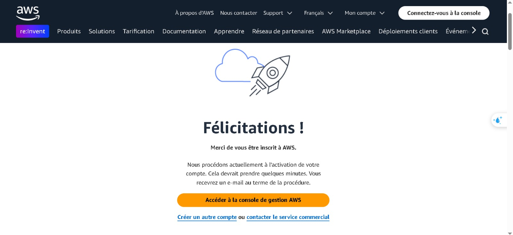

#### Gestion des Accès
- spécification des details de l'utilisateur IAM pour Jenkins.

    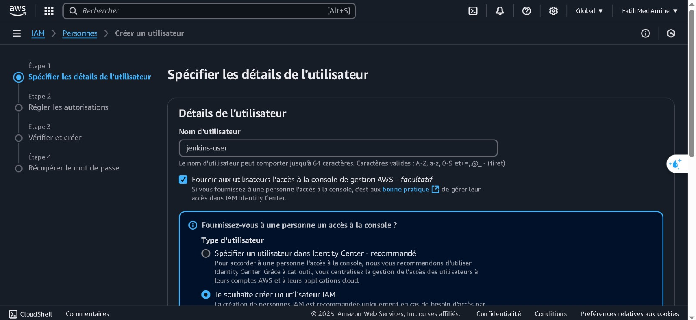

- Attribution des permissions nécessaires à l'utilisateur IAM pour EC2.

    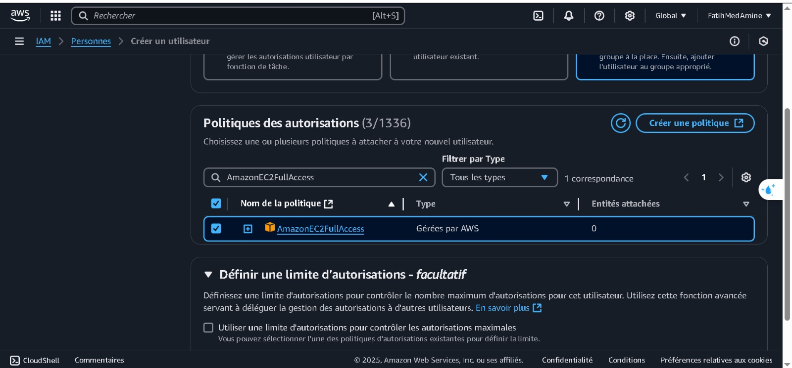

    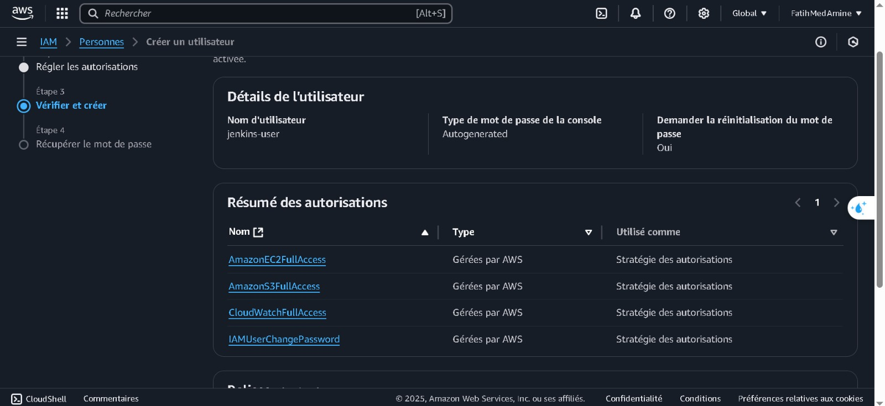

- Récupération de url d'accès à l'API AWS et du mot de passe d'accès.

    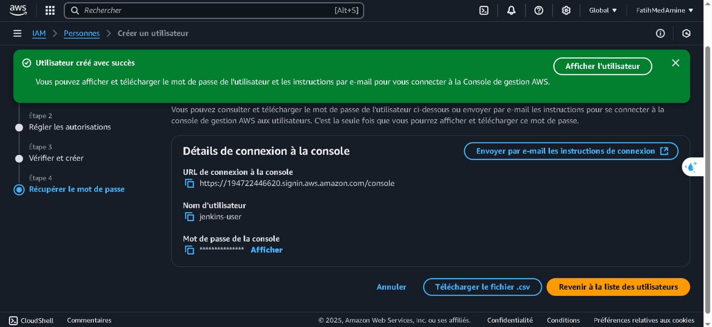

#### Lancement d'une Instance EC2
- Création d'une instance EC2 avec les spécifications suivantes :
    - **Type d'instance** : t3.micro (offre gratuite).
    - **Système d'exploitation** : Canonical Ubuntu 22.04 amd64.
    - **Groupe de sécurité** : Ouverture des ports 22 (SSH) et 80 (HTTP).
    - **Clé SSH** : Création d'une paire de clés pour l'accès SSH de type RSA de format PEM.

    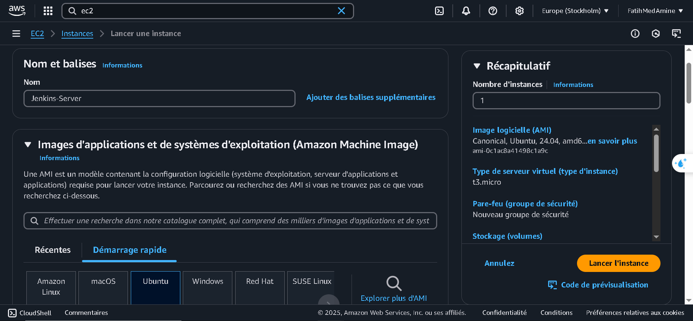

    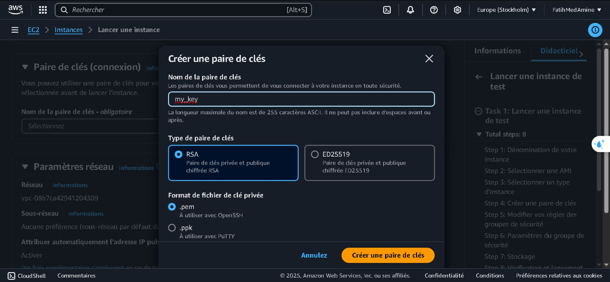

    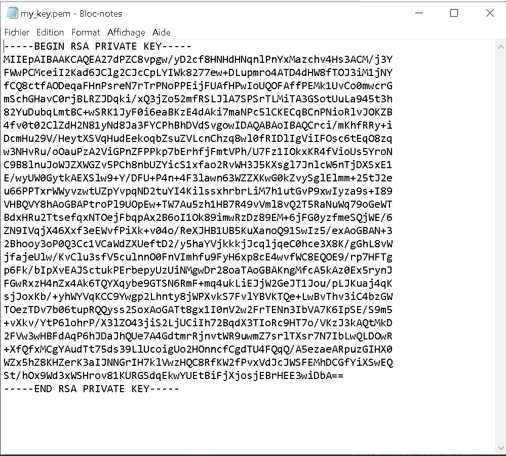

- Lancement de l'instance EC2 et récupération de l'adresse publique.

    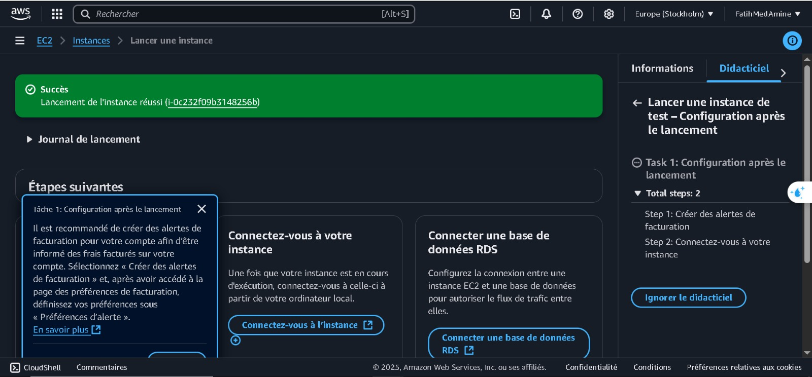

    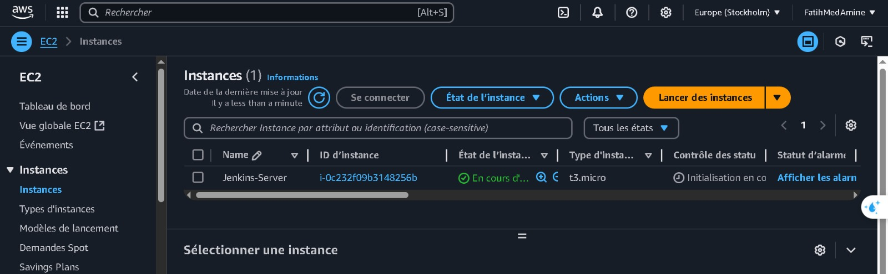

### Accès SSH à l'Instance EC2
- Connexion à l'instance EC2 via SSH avec la clé PEM générée.

    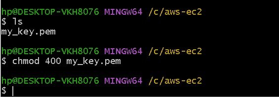

    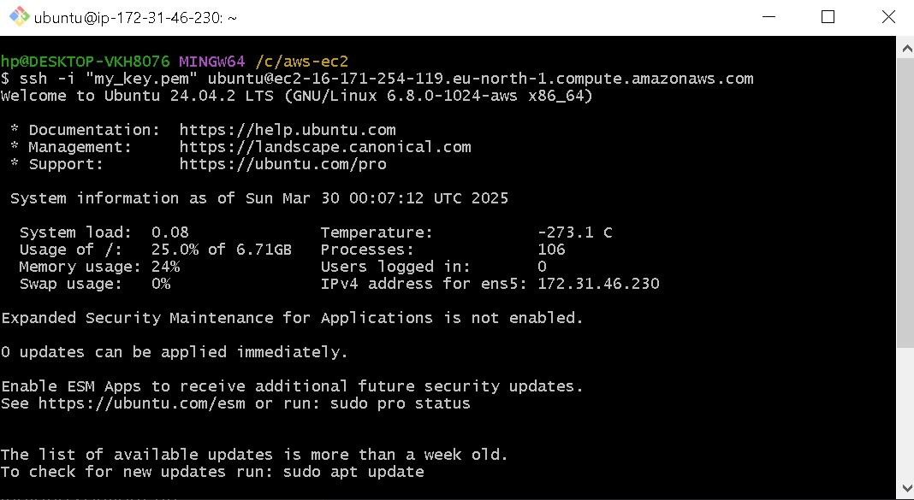

### Installation des Services

#### Docker
- Installation de Docker sur l'instance EC2 avec les commandes suivantes :
    ```bash
    # installation de l'update d'ubuntu
    $ sudo apt update
    # installation de docker
    $ sudo apt install docker.io
    # démarrage du service docker
    $ sudo systemctl start docker
    $ sudo systemctl enable docker
    # vérification de l'état du service docker
    $ docker --version
    # ajout de l'utilisateur ubuntu au groupe docker pour éviter d'utiliser sudo à chaque fois
    $ sudo usermod -aG docker ubuntu
    ```
    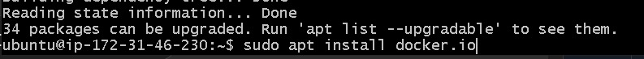

    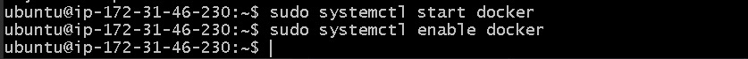

    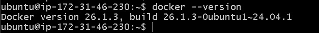

    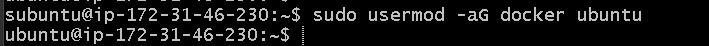

#### Jenkins
- Installation de Jenkins avec les commandes suivantes :
    ```bash
    # Ajout de la Clé Jenkins et Configuration du Dépôt
    $ curl -fsSL https://pkg.jenkins.io/debian/jenkins.io.key | sudo tee /usr/share/keyrings/jenkins-keyring.asc > /dev/null
    # démarrage du service jenkins
    $ sudo systemctl start jenkins
    $ sudo systemctl enable jenkins
    # vérification de l'état du service jenkins
    $ sudo systemctl status jenkins
    ```

    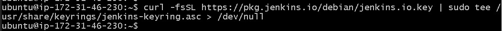

    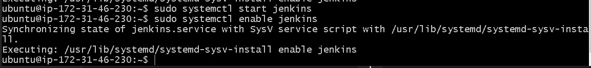

    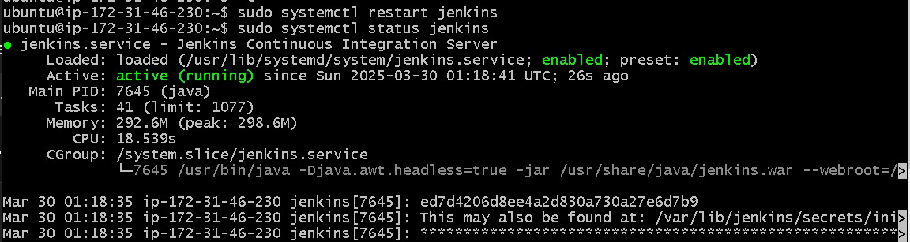

- Accès à l'interface web de Jenkins via `http://<adresse_ip_ec2>:8080` et récupération du mot de passe d'initialisation dans le fichier `/var/lib/jenkins/secrets/initialAdminPassword`.

    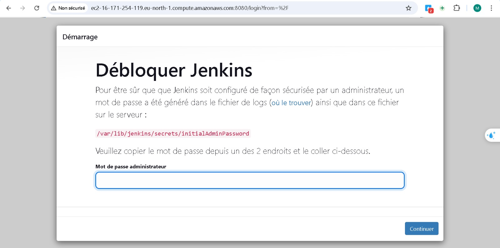

- Configuration de l'instance Jenkins en ajoutant URL de jenkins et le mot de passe d'accès.

    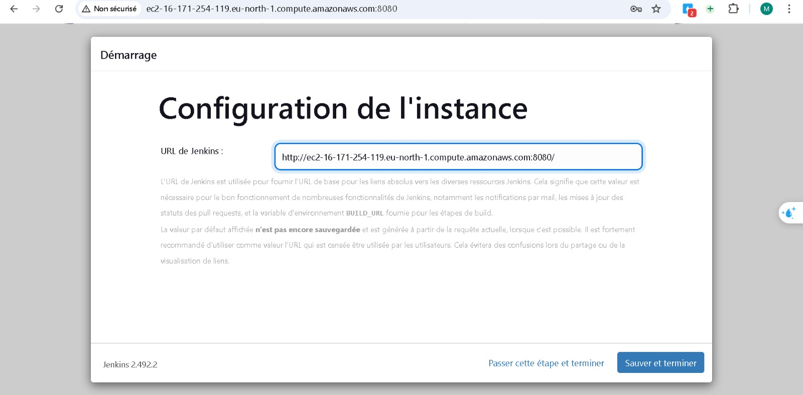

## Conclusion
Ce TP a permis de maîtriser :
- La création d'un pipeline CI/CD avec Jenkins
- Le déploiement automatisé sur des environnements cloud AWS
- L'industrialisation des processus de développement  